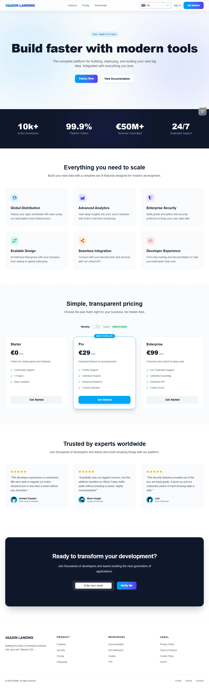
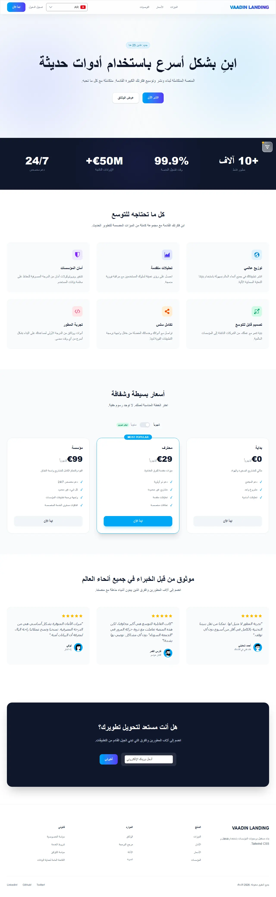
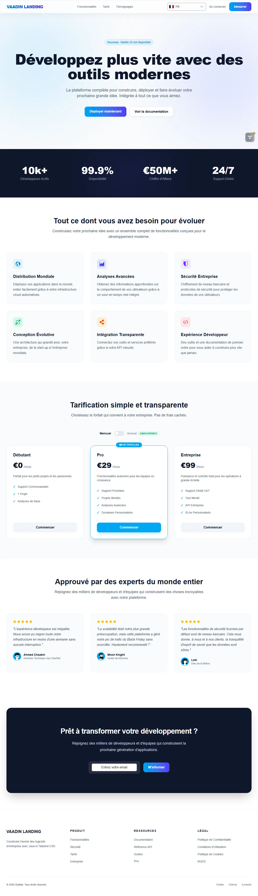
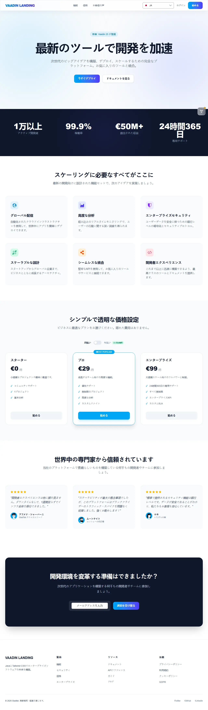

## Multi-Language Showcase

The landing page features full localization and RTL support. Here is a showcase of the four supported languages:

| English (LTR) | Arabic (RTL) |
| :---: | :---: |
|  |  |
| **French** | **Japanese** |
|  |  |

## Key Features

- **Full I18N (4 Languages)**: Localization for English, Arabic, French and Japanese.
- **RTL Support**: Native Right-to-Left layout support for Arabic with mirrored spacing and logic.
- **Organisation**: Organized into logical sub-packages (`model`, `section`, `layout`, `common`) for horizontal scalability.
- **Aware Component Pattern**: Decentralized translation logic where components resolve their own I18N keys.
- **Micro-Animations**: Smooth transitions, hover effects, and RTL-aware sliding toggles.

## Quick Start

### Development Mode

Start the application using Maven:

```bash
mvn package spring-boot:run
```

The application will be available at `http://localhost:8080`.

### Production Build

Create an optimized JAR for production:

```bash
mvn clean package -Pproduction
```

## Technology Stack

- **Vaadin 25.0.5+**: Java web framework with Vite integration.
- **Spring Boot 4.0+**: Backend infrastructure.
- **Tailwind CSS 4**: Next-gen utility-first CSS framework.
- **Vite**: Modern frontend build tool.
- **Java 21**

## Project Structure

The project follows a modular, feature-based architecture:

- `src/main/java/com/gladtek/vaadin/`
  - `data/`
    - `model/`: Domain records (`Feature`, `Plan`, `Stat`, `Testimonial`).
    - `footer/`: Footer configuration records.
  - `components/`
    - `layout/`: Base structural elements (`NavBar`, `AppFooter`, `LanguageSwitcher`).
    - `section/`: Page building blocks (`Hero`, `Features`, `Pricing`, `Testimonials`).
    - `common/`: Reusable cards and UI widgets.
  - `views/landing/`: Main view logic isolated by feature.
  - `services/`: Data provider and aggregator services.

## Themes and Styling

- **Tailwind Integration**: Utility classes applied directly in Java via `addClassNames()`.
- **Responsive Design**: Mobile-first approach using Tailwind's `md:`, `lg:` breakpoints.
- **Logical Properties**: RTL-aware styling using `start` and `end` instead of `left` and `right`.

> [!IMPORTANT]
> To use the Tailwind `@apply` directive in your CSS files, you must use **Vaadin version 25.0.5 or higher**. This ensures that the Vite build pipeline correctly processes Tailwind directives within your stylesheets.

## Deployment

### Docker

#### Run an existing image:

```bash
docker run -p 9000:8080 achaabni/vaadin-tailwind-landing:latest
```

#### Build your own Docker image:

```bash
docker build -t vaadin-tailwind-landing:latest .
```

Run the container:

```bash
docker run -p 8080:8080 vaadin-tailwind-landing:latest
```

---

*Built by Gladtek*
