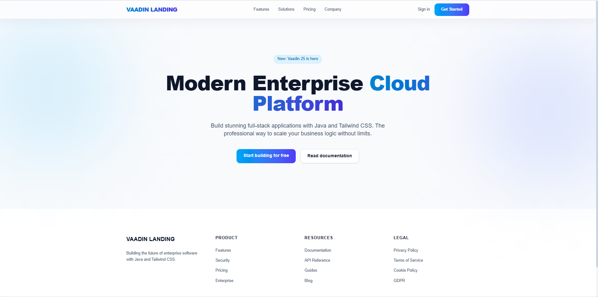

# Vaadin Tailwind Landing Page



A minimal example of **Vaadin 25 (Flow)**, **Spring Boot**, and **Tailwind CSS 4**. 

> [!NOTE]
> This project is designed as a **minimal UI showcase** focusing on Tailwind CSS integration. Unlike traditional Vaadin applications that rely heavily on high-level components (like Grid or FormLayout), this example uses low-level elements (`Div`, `Span`, `Nav`) and layout containers (`VerticalLayout`, `HorizontalLayout`) styled exclusively with Tailwind utility classes.


## Quick Start

### Development Mode

Start the application using the Maven wrapper:

```bash
./mvnw
```

The application will be available at `http://localhost:8080`.

### Production Build

Create an optimized JAR for production:

```bash
./mvnw clean package
```

## Technology Stack

- **Vaadin 25**: Java framework for building modern web apps.
- **Spring Boot 4**: Backend infrastructure and dependency injection.
- **Tailwind CSS 4**: Modern CSS framework for rapid UI development.
- **Vite**: Ultra-fast frontend build tool integrated with Vaadin.
- **Java 21**

## Project Structure

The project follows a component-based architecture:

- `src/main/java/com/gladtek/vaadin/`
  - `Application.java`: Main entry point.
  - `views/LandingView.java`: Main landing page layout.
  - `components/`
    - `NavBar.java`: Responsive navigation menu.
    - `Hero.java`: High-impact hero section with gradients.
    - `AppFooter.java`: Multi-column footer with social links.

- `src/main/frontend/`
  - `generated/tailwind.css`: Compiled Tailwind styles.
  - `maintenance.css`: Custom utility classes and overrides.

## Themes and Styling

- **No theme**: Zero Theme by default.
- **Tailwind CSS Integration**: Direct usage of Tailwind classes in Java code via `addClassNames()`.

> [!IMPORTANT]
> Currently, CSS files using Tailwind's `@apply` directive is currently loaded using the `@CssImport` annotation in the main layout or view. Using `@StyleSheet` for these files may result in `@apply` rules not being correctly processed by the Vite build pipeline. A fix is in the way by **Vaadin team**

## Deployment

### Docker

Build the Docker image:

```bash
docker build -t vaadin-tailwind-landing:latest .
```

Run the container:

```bash
docker run -p 8080:8080 vaadin-tailwind-landing:latest
```

---

*Built by Gladtek*
