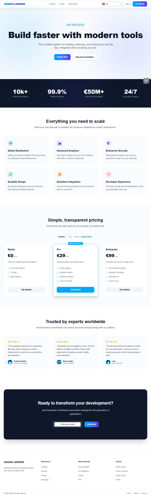
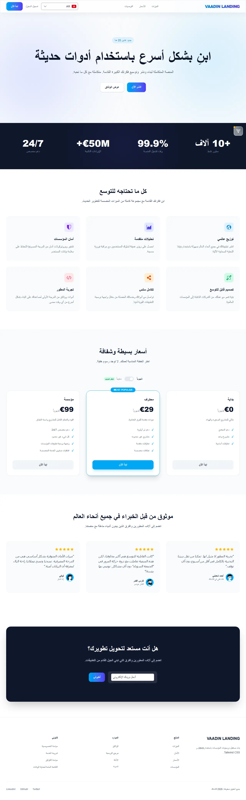
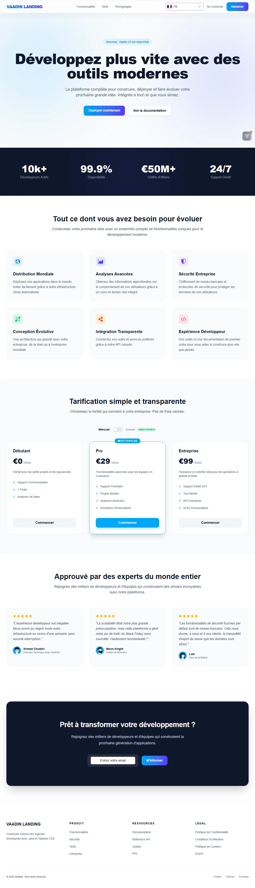
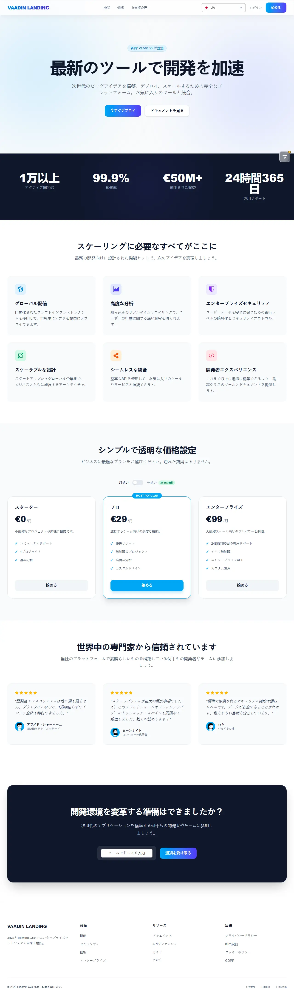

# Modern Vaadin Landing Page

A high-performance, responsive landing page built with **Vaadin 25**, **Spring Boot 4**, and **Tailwind CSS 4**. This project showcases modern Java web development practices with a focus on localization (I18N), RTL support, and a modular architecture.

## Multi-Language Showcase

The landing page features full localization and native RTL support. Here is a showcase of the four supported languages:

| English (LTR) | Arabic (RTL) |
| :---: | :---: |
|  |  |
| **French** | **Japanese** |
|  |  |

## Key Features

-   **Full I18N (4 Languages)**: Comprehensive localization for English, Arabic, French, and Japanese.
-   **Native RTL Support**: Automated layout mirroring for Arabic, utilizing Tailwind's logical properties.
-   **Modular Architecture**: Organized into logical sub-packages (`model`, `section`, `layout`, `common`) for high maintainability.
-   **Translation-Aware Components**: A decentralized pattern where components resolve their own I18N keys using a custom `I18NAware` approach.
-   **Modern Tech Stack**: Leverages the latest Vaadin 25 features and Tailwind CSS 4 utility-first approach.
-   **Micro-Animations**: Smooth transitions, interactive hover effects, and direction-aware components.
-   **PWA Ready**: Out-of-the-box support for Progressive Web App features.

## Technology Stack

-   **Vaadin 25.1.1**: Modern Java web framework with Vite-native performance.
-   **Spring Boot 4.0.5**: Robust backend infrastructure.
-   **Tailwind CSS 4.2.1**: Next-generation utility-first CSS framework with JIT engine.
-   **Vite 7.3.1**: Rapid frontend build tool.
-   **Java 21**: Utilizing modern Java features like Records for data models.

## Project Structure

The project follows a modular, feature-based architecture:

-   `src/main/java/com/gladtek/vaadin/`
    -   `data/model/`: Domain structures using Java Records (`Feature`, `Plan`, `Stat`, `Testimonial`).
    -   `components/`
        -   `layout/`: Structural elements (`NavBar`, `AppFooter`, `LanguageSwitcher`).
        -   `section/`: High-level page sections (`Hero`, `Features`, `Stats`, `Pricing`, `Testimonials`, `CTA`).
        -   `common/`: Reusable UI widgets (`FeatureCard`, `PricingCard`, `StarRating`, `SectionHeader`).
    -   `i18n/`: Custom internationalization logic and `CustomI18NProvider`.
    -   `views/landing/`: Main landing page composed of modular sections.

## Quick Start

### Prerequisites

-   Java 21 or higher
-   Maven 3.9+
-   Node.js 22+ (Vaadin will handle the installation if not present)

### Development Mode

Start the application using Maven:

```bash
mvn package spring-boot:run
```

The application will be available at `http://localhost:8080`.

### Production Build

Create an optimized JAR for production:

```bash
mvn clean package -Pproduction
```

## Styling and Themes

-   **Tailwind Integration**: Utility classes are applied directly in Java via `addClassNames()`.
-   **Responsive Design**: Mobile-first approach using Tailwind's `md:`, `lg:` breakpoints.
-   **Logical Properties**: RTL-aware styling using `s-` and `e-` (start/end) instead of `l-` and `r-` (left/right).

> [!IMPORTANT]
> To use the Tailwind `@apply` directive in your CSS files, this project uses **Vaadin 25.1.1**. This ensures that the Vite build pipeline correctly processes Tailwind directives within `src/main/resources/META-INF/resources/frontend/styles.css`.

## Deployment

### Docker

#### Run an existing image:

```bash
docker run -p 9000:8080 achaabni/vaadin-tailwind-landing:latest
```

#### Build your own Docker image:

```bash
docker build -t vaadin-tailwind-landing:latest .
```

Run the container:

```bash
docker run -p 8080:8080 vaadin-tailwind-landing:latest
```

---

*Built by [Gladtek](https://www.gladtek.com)*
